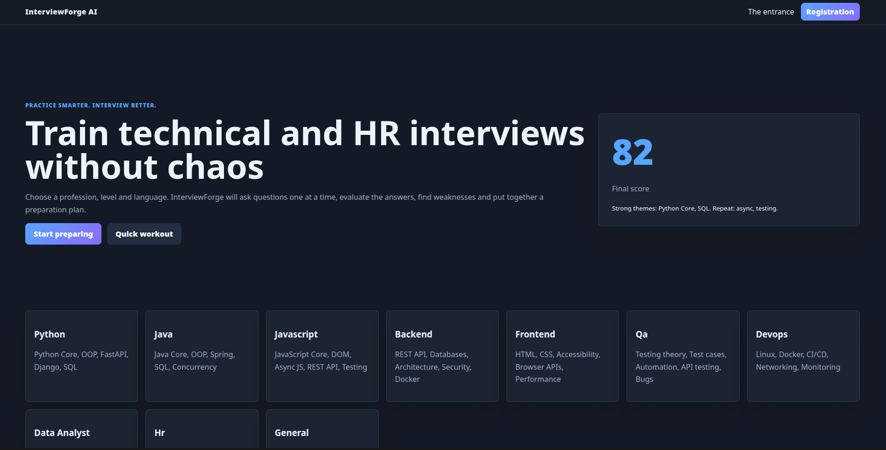
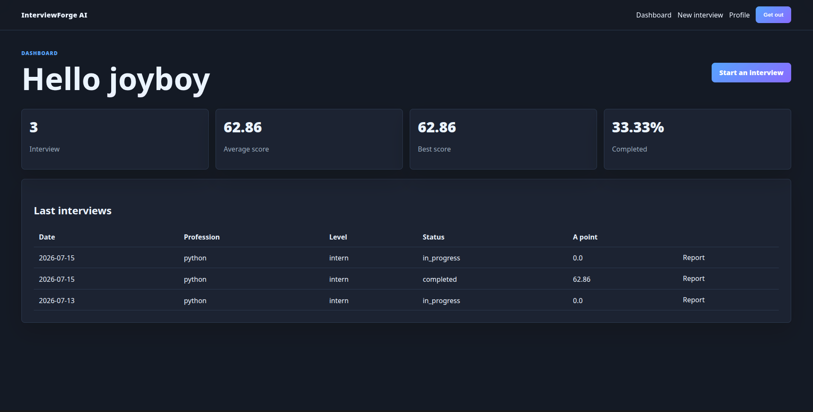
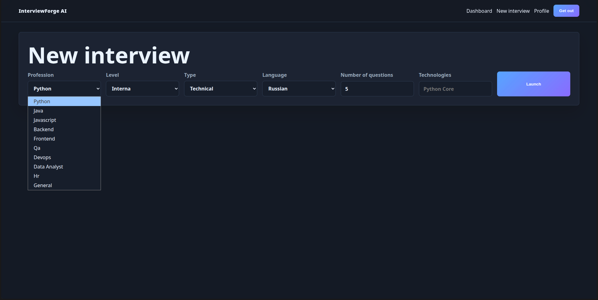
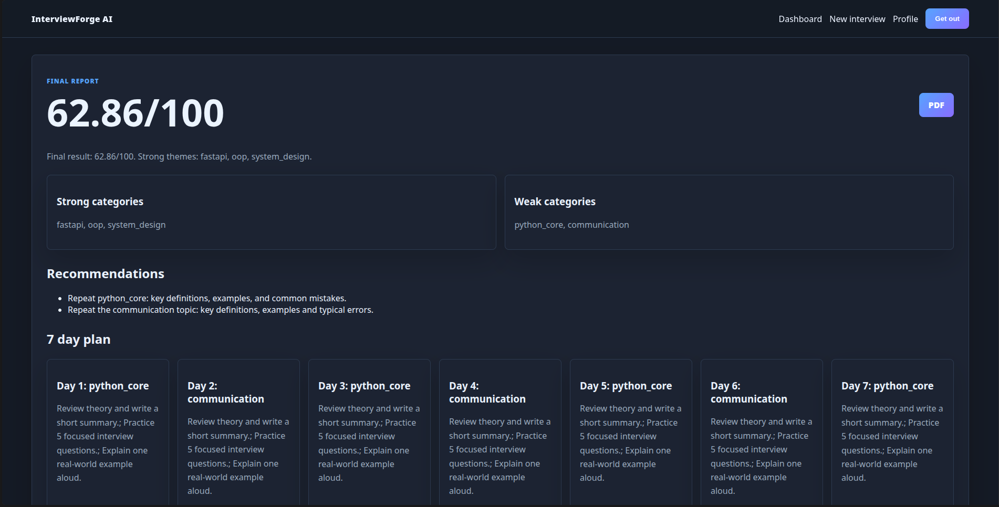

# InterviewForge AI


InterviewForge AI is a SaaS-style FastAPI app for practicing technical and HR interviews. It works with local questions and local answer evaluation, so it can run without external AI keys.

> Practice smarter. Interview better.

## App Experience






## Features

- Registration, login, logout, and protected pages.
- Sequential interviews by profession, level, type, language, and question count.
- Local question bank with 200 questions across Python, Java, JavaScript, Backend, Frontend, QA, DevOps, Data Analyst, HR, and General Software Engineering.
- Local answer scoring from keywords, expected points, answer length, and clarity.
- AI provider interface with Groq, Gemini, OpenRouter, Ollama, and Mock fallback.
- Final reports, 7-day study plan, statistics, PDF export, JSON API, and CLI practice mode.
- Docker, Alembic, pytest, Ruff, and GitHub Actions.

## Why It Stands Out

Most interview-practice tools depend fully on external AI APIs. InterviewForge AI keeps a useful local mode: question bank, scoring, reports, CLI practice, and PDF export all work offline. AI providers can improve the experience, but they are not required.

## Quick Start

```bash
python -m venv .venv
.venv\Scripts\activate
pip install -r requirements.txt
copy .env.example .env
alembic upgrade head
python scripts/seed_questions.py
python run.py
```

Linux/macOS activation:

```bash
source .venv/bin/activate
```

Open `http://127.0.0.1:8000`.

## Run Without AI

The default `.env.example` uses:

```env
AI_PROVIDER=mock
```

No API key is required. The app uses local evaluation and Mock AI follow-up questions.

## AI Providers

Set `AI_PROVIDER` to `groq`, `gemini`, `openrouter`, `ollama`, or `mock`.

Remote provider classes share one interface. In this first open-source version they safely fall back to local/mock behavior unless keys and real client code are added.

## Docker

```bash
docker compose up --build
```

The compose file starts the app and PostgreSQL with a healthcheck.

## Migrations

```bash
alembic upgrade head
alembic revision --autogenerate -m "description"
```

## Tests

```bash
ruff check .
python scripts/check_question_files.py
pytest
```

## CLI

```bash
python -m app.cli practice --profession python --level junior
```

## Project Structure

```text
app/                  FastAPI app, routers, models, services, templates
data/questions/       Local JSON question bank
scripts/              Seeding and validation helpers
tests/                Pytest suite
migrations/           Alembic migrations
docs/                 Architecture, database, AI, security notes
```

## Security

Passwords are hashed, sessions are signed HttpOnly cookies, `.env` is ignored, and ownership checks protect interview reports.

## Roadmap

- Real HTTP clients for Groq, Gemini, OpenRouter, and Ollama.
- Per-user encrypted API keys.
- Question import UI.
- Public result pages without private answers.
- More localized interface strings.
- More real-world question packs for Python, QA, DevOps, and Data Analyst tracks.

## Contributing

Open an issue with the use case, keep changes focused, add tests for behavior, and run Ruff and pytest before submitting a pull request.

## License

MIT
